Баги на странице со скриншота

**1. [Кнопка сброса поиска]** У кнопки отсутсвует изображение крестика. Вместо него плейсхолдер изображения.
Приоритет: medium - баг на видном месте, лишает пользователя возможности понять функционал кнопки, при этом, возможность стереть текст не пропадает.

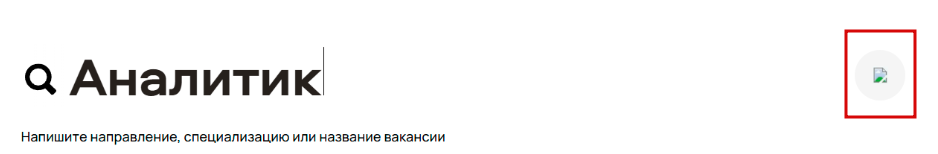

**2. [Фильтры по профессиям внутри направления]** Внутри выбранного направления "Data Science" предложены фильтры по профессиям, которых нет внутри направления.
Приоритет: high - главный функционал страницы.

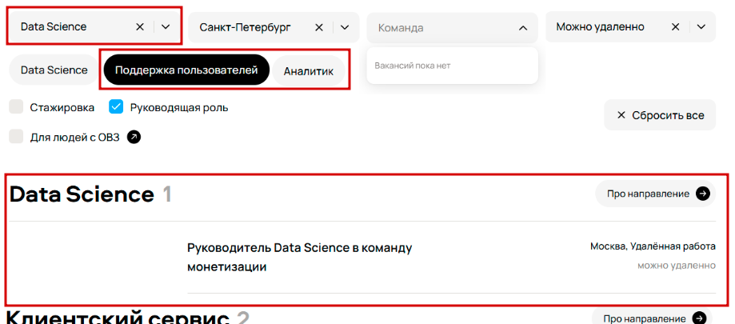

**3. [Фильтр по городу]** При выбранном фильтре "Санкт-Петербург" в выдаче вакансии с другимим городами.
Приоритет: high - главный функционал страницы.

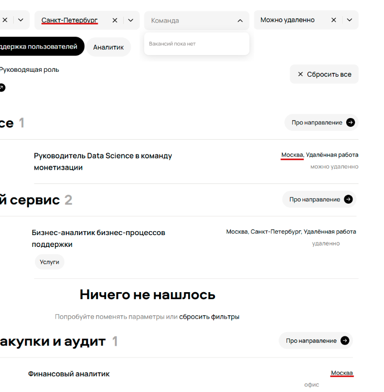

**4. [Выпадающие списки фильтров]** Судя по проду, исключена возможность выбрать города, где нет вакансий по выбранному направлению (и наоборот), а значит варианта "Санкт-Петербург" для "Data Science" не должно быть. Скриншот с прода. Возможно, здесь просто не предусмотрена эта фича, тогда и багом не считается.
Приоритет: low - это крайне удобная фича, но не является главным функционалом.

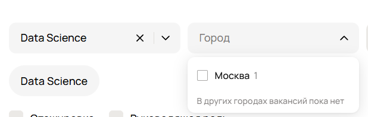

**5. [Работа фильтрации]** Некорректная работа фильтров. К выбранным фильтрам не подходит ни одна вакансия, при этом отображается множество вакансий над и под сообщением "Ничего не нашлось".
Приоритет: high - главный функционал страницы.

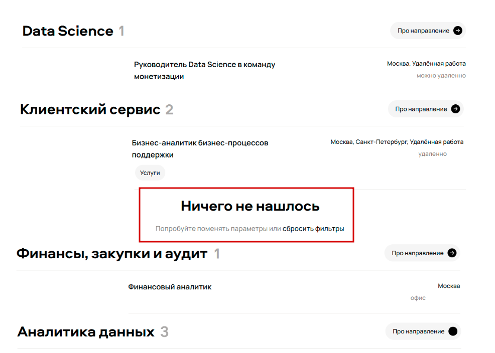

**6. [Кнопка "Про направление"]** У направления "Аналитика данных" кнопка "Про направление" без стрелки. 
Приоритет: low - функционал для пользователя остаётся ясен.

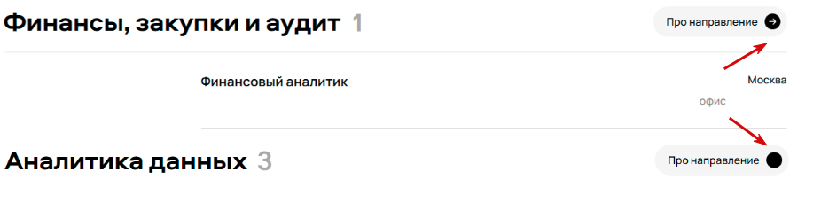

**7. [Строка формата работы в панели вакансии]** Неровные отступы в строках формата работы. Возможно, невидимость или отсутствие части текста. Если это сугубо проблема отступов, тогда здесь частично затрагивается баг фильтрации из пункта 5, так как выданы вакансии с форматом работы "офис" при фильтре "Можно удаленно".
Приоритет: medium - баг встречается часто и, возможно, не отображается часть важной информации о вакансии.

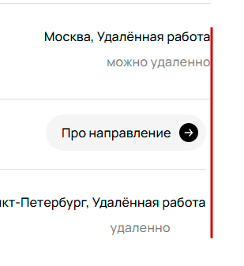
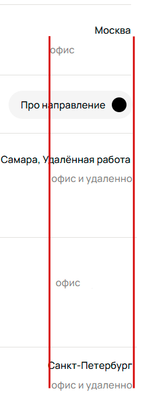

**8. [Строка города в панели вакансии]** Неровные отступы в строках названий городов. 
Приоритет: low

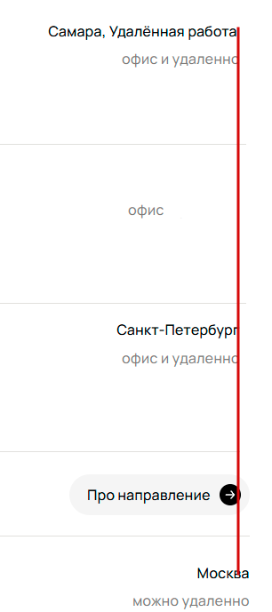

**9. [Строка города в панели вакансии]** Невидимость или отсутствие текста.
Приоритет: medium - не отображается важная информация о вакансии.

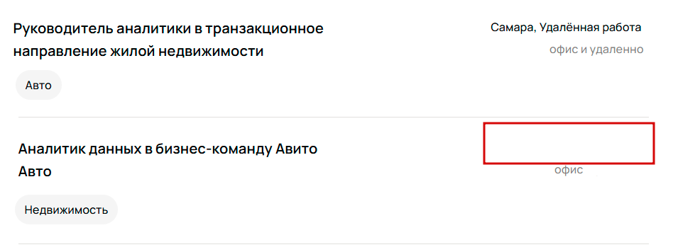

**10. [Шапка списка вакансий по направлению]** Количество вакансий в шапке не совпадает с фактическим количеством. Либо вместо панели вакансии использована панель "Ничего не нашлось" 
Приоритет: high - нарушен функционал выдачи результатов.

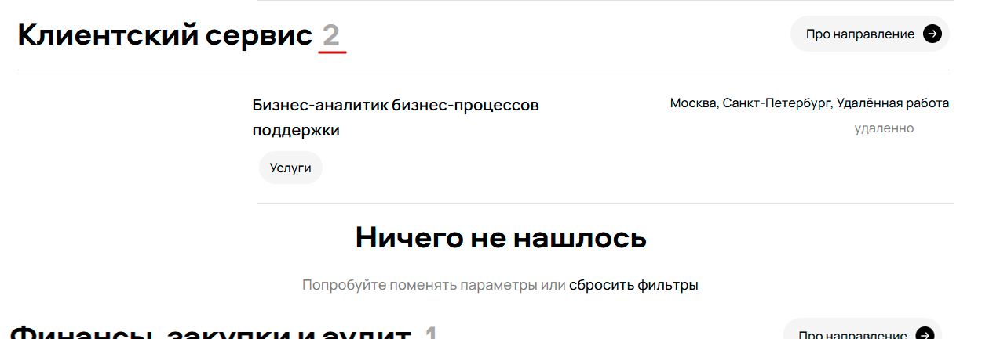

**11. [Кнопка "Все вакансии" в списке вакансий по направлению]** Возможно не баг, но в проде кнопка есть. На скриншоте задания нет ни одной кнопки "Все вакансии". Приложил скриншот с прода.
Приоритет: low - так как на скриншоте не скрывает в себе вакансии (возможно в пункте 10, тогда high!), следовательно не влияет на функционал. 

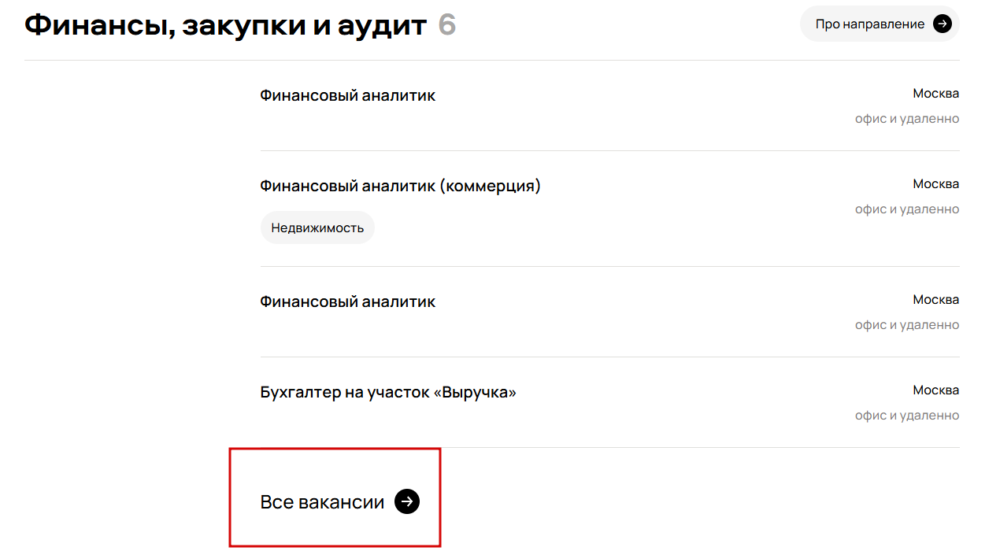

**12. [Список вакансий по направлению]** В списке находится вакансия, не принадлежащая направлению.
Приоритет: high - нарушен функционал выдачи результатов.

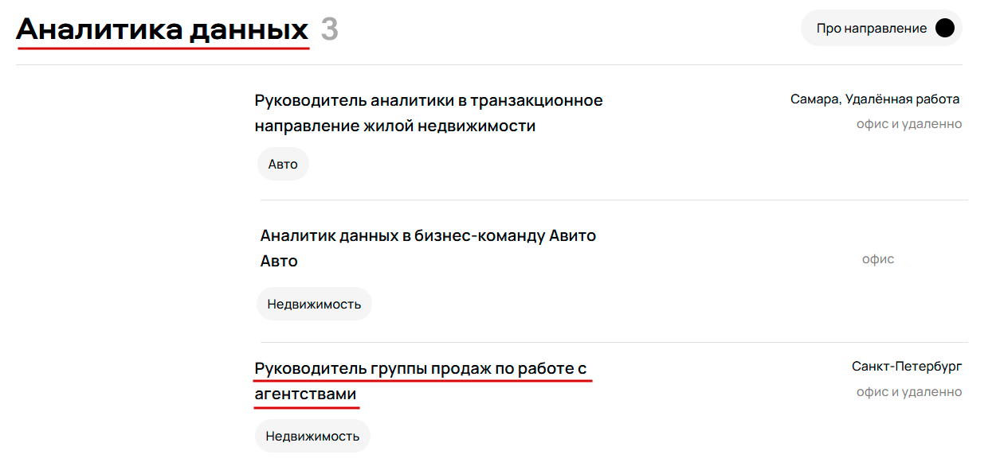

**13. [Панель вакансий]** В панели вакансии у кнопок со ссылками на "Avito Team" логически несовпадающий с вакансией текст. Возможно, ссылки тоже некорректные.
Приоритет: medium - так как может быть нарушен функционал перееадресации, если неверные ссылки.

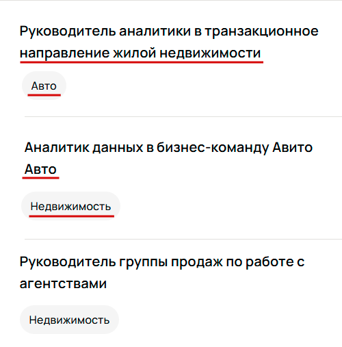

**14. [Строка формата работы в панели вакансии]**  Частичное использование замены "ё" на "е" в строках формата работы.
Приоритет: low

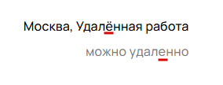

**15. [Шапка списка вакансий по направлению]** Разные отступы названий направлений.
Приоритет: low

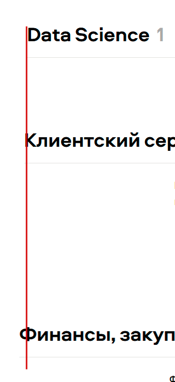 

**16. [Текст в футере страницы]** Грамматичсекая ошибка в слове "вакансий".
Приоритет: low

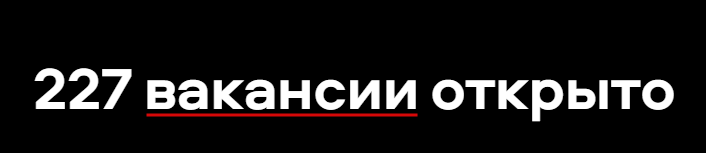

**17. [Текст в футере страницы]** Грамматическая ошибка в слове "Telegram". Возможно нарушение правил использования названия и логотипа?
Приоритет: low

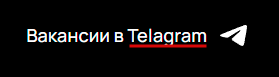

**18. [Текст в футере страницы]** Ошибка в адресе офиса в Москве.
Приоритет: high - страдает имидж, неверная информация о компании.

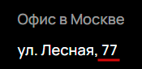

**19. [Текст в футере страницы]** Допустимо ли разговорное название города?
Приоритет: -

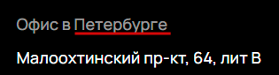

**20. [Панель вакансии]** У текста названий вакансий разные отступы.
Приоритет: low

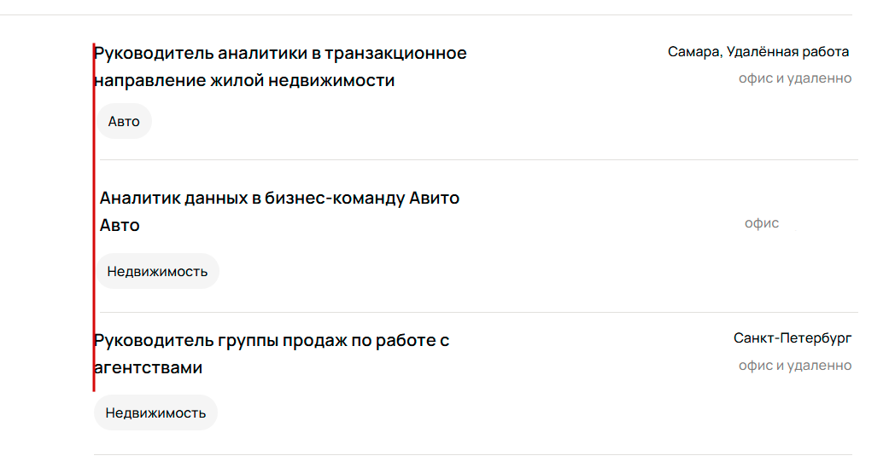

**21. [Фильтр "Руководящая роль"]** При выбранном фильтре "Руководящая роль" выданы неподходящие вакансии.
Приоритет: high - главный функционал страницы.

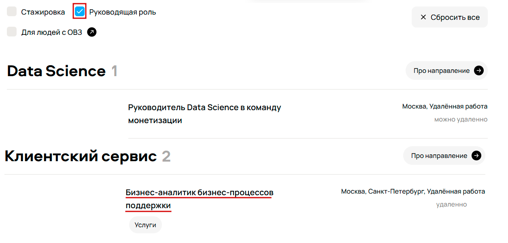
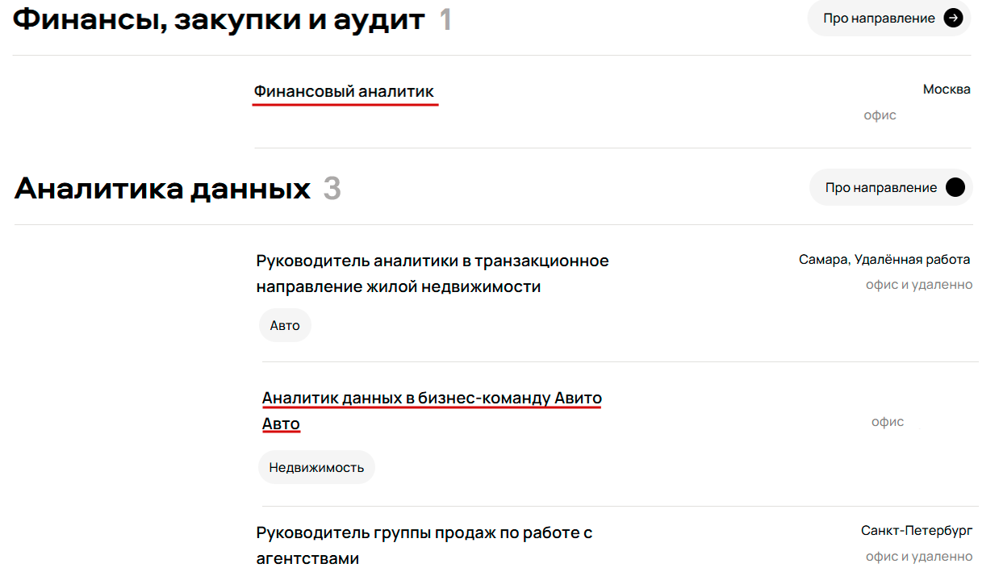
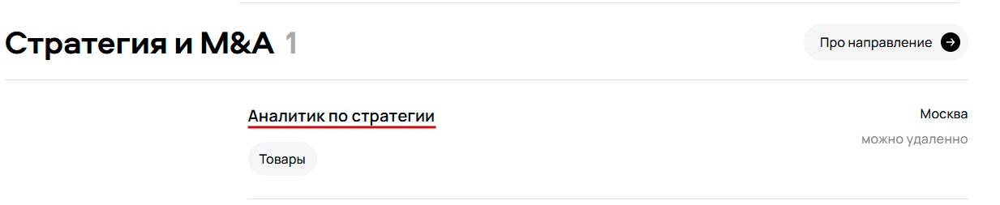

**22. [Фильтр по направлению]** При выбранном фильтре "Data Science" кроме "Data Science" выданы и другие направления.
Приоритет: high - главный функционал страницы.

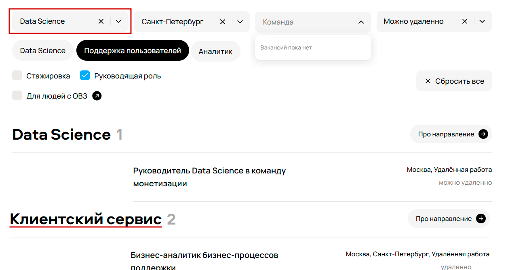